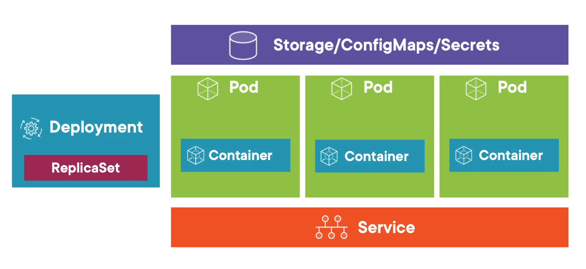
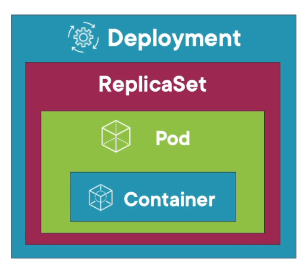

# Understanding deployments



## Deployment options
- Rolling Updates
- Blue/Green Deployments
- Canary Deployments
- Rollbacks

## Creating a deployment
- YAML + kubectl

```shell
kubectl create deployment nginx --image=nginx:alpine

kubectl create deployment nginx --image=nginx:alpine --dry-run=client -o yaml > deploy.yaml
```

## Create

### Spec
- Selector: used to select the template to use

### Template
Used to create the pod/container

# Jobs
- Job controller manages pods
- Offer intelligence
- Can run set number of pods and in parallel

## Set namespace
```shell
kubectl config set-context --current --namespace=pluralsight
```